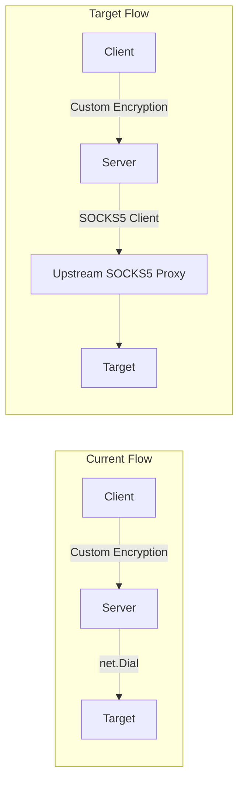

# Upstream SOCKS5 Proxy Chaining Implementation

## Current vs Target Architecture



## Implementation Plan

### 1. Add SOCKS5 Client Module

Create a new file `internal/socks5/client.go` to implement SOCKS5 client handshake per RFC 1928 and RFC 1929:

**Key Components:**

- `DialWithAuth(proxyAddr, targetAddr, username, password string)` - Main entry function
- `negotiateAuth()` - Send auth method negotiation (support 0x00 No Auth + 0x02 Username/Password)
- `authenticate()` - RFC 1929 username/password auth subnegotiation
- `sendConnectRequest()` - SOCKS5 CONNECT command to target

**Protocol Details (RFC 1928):**

```
// Auth Negotiation
Client -> Proxy: [VER=0x05][NMETHODS][METHODS...]
Proxy -> Client: [VER=0x05][METHOD]

// Connect Request  
Client -> Proxy: [VER=0x05][CMD=0x01][RSV=0x00][ATYP][DST.ADDR][DST.PORT]
Proxy -> Client: [VER=0x05][REP][RSV][ATYP][BND.ADDR][BND.PORT]
```

### 2. Extend Server Configuration

Modify [`internal/config/config.go`](internal/config/config.go):

```go
type ServerConfig struct {
    // ... existing fields ...
    
    // Upstream SOCKS5 proxy configuration
    UpstreamProxy    string `json:"upstream_proxy"`     // e.g., "proxy.example.com:1080"
    UpstreamUsername string `json:"upstream_username"`  // optional
    UpstreamPassword string `json:"upstream_password"`  // optional
}
```

Add helper method `HasUpstreamProxy() bool` to check if upstream is configured.

### 3. Modify Server Connection Logic

Update [`cmd/server/main.go`](cmd/server/main.go) line 107:

**Before:**

```go
target, err := net.DialTimeout("tcp", targetAddr, cfg.GetTimeout())
```

**After:**

```go
var target net.Conn
if cfg.HasUpstreamProxy() {
    target, err = socks5.DialWithAuth(
        cfg.UpstreamProxy,
        targetAddr,
        cfg.UpstreamUsername,
        cfg.UpstreamPassword,
        cfg.GetTimeout(),
    )
} else {
    target, err = net.DialTimeout("tcp", targetAddr, cfg.GetTimeout())
}
```

### 4. Update Configuration Files

Update [`server.config.json`](server.config.json):

```json
{
  "port": 8081,
  "password": "your-password",
  "timeout": 30,
  "log_level": "info",
  "obfuscate": true,
  "upstream_proxy": "residential-proxy.example.com:1080",
  "upstream_username": "proxy_user",
  "upstream_password": "proxy_pass"
}
```

## Key Design Decisions

| Aspect | Choice | Rationale |

|--------|--------|-----------|

| Implementation | Manual (no external lib) | Learning purpose + full control + minimal dependencies |

| Auth Methods | 0x00 + 0x02 | Commercial proxies typically require username/password |

| Address Type | Domain-based (ATYP=0x03) | Residential proxies should resolve DNS, not the server |

| Error Handling | Detailed error codes | RFC 1928 defines specific reply codes for debugging |

## File Changes Summary

| File | Action |

|------|--------|

| `internal/socks5/client.go` | **Create** - SOCKS5 client implementation |

| `internal/config/config.go` | **Modify** - Add upstream proxy fields |

| `cmd/server/main.go` | **Modify** - Conditional upstream routing |

| `server.config.json` | **Modify** - Add example upstream config |