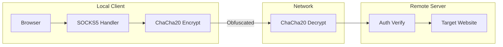

# Go 代理加密升级计划

## 架构概览



## 文件结构变更

```
go-proxy-eins/
├── cmd/
│   ├── local/main.go      # 本地客户端入口
│   └── server/main.go     # 服务端入口
├── internal/
│   ├── cipher/cipher.go   # ChaCha20-Poly1305 加密实现
│   ├── config/config.go   # 配置加载（JSON + CLI）
│   ├── protocol/          # 协议层
│   │   ├── handshake.go   # 认证握手
│   │   └── obfuscate.go   # 流量混淆
│   └── logger/logger.go   # 日志模块
├── config.example.json    # 配置文件示例
└── go.mod
```

## 核心实现

### 1. 加密模块 - ChaCha20-Poly1305

- 使用 `golang.org/x/crypto/chacha20poly1305` 提供 AEAD 加密
- 密钥派生：从用户密码通过 `Argon2id` 派生 32 字节密钥
- 每个数据帧使用递增 nonce（12 字节），防止重放攻击
- 数据格式：`[2字节长度][nonce][加密数据+auth tag]`

### 2. 配置模块

支持的配置项：

| 配置项 | 命令行 | 说明 |

|--------|--------|------|

| server | -s | 服务器地址 |

| port | -p | 监听端口 |

| password | -k | 加密密码 |

| timeout | -t | 连接超时（秒） |

| log_level | -l | 日志级别 (debug/info/warn/error) |

| obfuscate | -o | 启用流量混淆 |

加载顺序：默认值 -> 配置文件 -> 命令行参数

### 3. 认证协议

握手流程：

1. Client 生成随机 salt，发送 `[salt][timestamp][HMAC(password, salt+timestamp)]`
2. Server 验证 HMAC 和时间戳（防重放，允许 30 秒误差）
3. Server 回复 `[0x00]` 成功或 `[0x01]` 失败

### 4. 流量混淆

- 在每个数据包前后添加随机长度填充 (0-64 字节)
- 数据格式：`[1字节前填充长度][前填充][实际数据][后填充]`
- 使填充后的数据长度更加随机，模糊真实流量模式

### 5. 超时与日志

- 连接超时：`net.DialTimeout` + `SetDeadline`
- 读写超时：每次操作前重置 deadline
- 日志级别：使用 `log/slog` 标准库

## 依赖

```
golang.org/x/crypto  # ChaCha20-Poly1305, Argon2
```

## 使用示例

```bash
# 服务端
./server -p 8081 -k "your-password" -l info

# 客户端
./local -s "server.example.com:8081" -k "your-password"

# 或使用配置文件
./local -c config.json
```