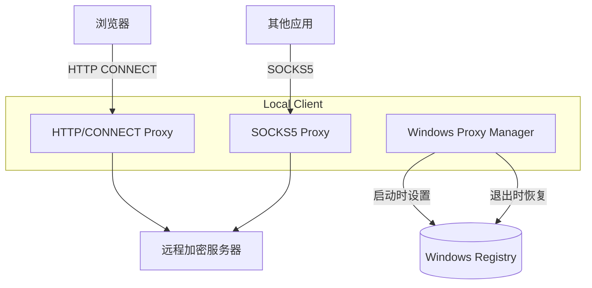

# 客户端系统代理自动设置优化

## 背景分析

当前客户端 (`cmd/local/main.go`) 是纯 SOCKS5 代理，监听 `127.0.0.1:1080`。Windows 系统代理对 HTTP 代理支持最好，因此需要：

1. 增加 HTTP/CONNECT 代理能力
2. 启动时自动设置 Windows 系统代理
3. 退出时恢复原有代理设置

## 架构设计



## 实现步骤

### 1. 新增 Windows 代理管理模块

创建 `internal/sysproxy/windows.go`：

- `GetCurrentProxy()` - 获取当前系统代理设置
- `SetHTTPProxy(addr string)` - 设置系统 HTTP 代理
- `RestoreProxy(backup)` - 恢复原有代理设置

**关键注册表路径**：

```
HKEY_CURRENT_USER\Software\Microsoft\Windows\CurrentVersion\Internet Settings
- ProxyEnable (DWORD): 0/1
- ProxyServer (STRING): 127.0.0.1:8080
- ProxyOverride (STRING): localhost;127.*;...
```

### 2. 新增 HTTP CONNECT 代理处理器

创建 `internal/httpproxy/handler.go`：

- 解析 HTTP CONNECT 请求（如 `CONNECT github.com:443 HTTP/1.1`）
- 复用现有加密隧道逻辑连接远程服务器
- 返回 `HTTP/1.1 200 Connection Established`
- 双向转发数据

### 3. 修改配置结构

更新 [internal/config/config.go](internal/config/config.go)：

```go
type LocalConfig struct {
    // ...现有字段
    HTTPProxyAddr string `json:"http_proxy_addr"` // HTTP 代理监听地址，如 "127.0.0.1:8080"
    AutoProxy     bool   `json:"auto_proxy"`      // 是否自动设置系统代理
}
```

### 4. 修改客户端入口

更新 [cmd/local/main.go](cmd/local/main.go)：

- 启动时：

  1. 备份当前系统代理设置
  2. 设置 Windows 系统代理指向 HTTP 代理地址
  3. 启动 SOCKS5 + HTTP 双协议监听

- 退出时（使用 `os/signal` 监听 `SIGINT`/`SIGTERM`）：

  1. 恢复原有系统代理设置
  2. 关闭监听器

### 5. 更新配置示例

更新 [config.example.json](config.example.json) 和 [local.config.json](local.config.json)。

## 关键代码片段

**HTTP CONNECT 解析**（核心逻辑）：

```go
// 读取第一行判断协议类型
firstLine, _ := reader.ReadString('\n')
if strings.HasPrefix(firstLine, "CONNECT ") {
    // HTTP CONNECT: "CONNECT host:port HTTP/1.1"
    handleHTTPConnect(client, firstLine, cfg)
} else if firstLine[0] == 0x05 {
    // SOCKS5: 第一字节是版本号 0x05
    handleSOCKS5(client, firstLine, cfg)
}
```

**Windows 注册表操作**（使用 `golang.org/x/sys/windows/registry`）：

```go
key, _ := registry.OpenKey(registry.CURRENT_USER, 
    `Software\Microsoft\Windows\CurrentVersion\Internet Settings`, 
    registry.ALL_ACCESS)
key.SetDWordValue("ProxyEnable", 1)
key.SetStringValue("ProxyServer", "127.0.0.1:8080")
```

## 涉及文件

| 文件 | 操作 |

|------|------|

| `internal/sysproxy/windows.go` | 新建 |

| `internal/httpproxy/handler.go` | 新建 |

| `internal/config/config.go` | 修改 |

| `cmd/local/main.go` | 修改 |

| `config.example.json` | 修改 |

| `local.config.json` | 修改 |

| `go.mod` | 添加依赖 `golang.org/x/sys` |

## 使用方式

启动后，系统代理会自动配置，浏览器无需任何设置即可访问 GitHub。按 `Ctrl+C` 退出时自动恢复原有代理设置。